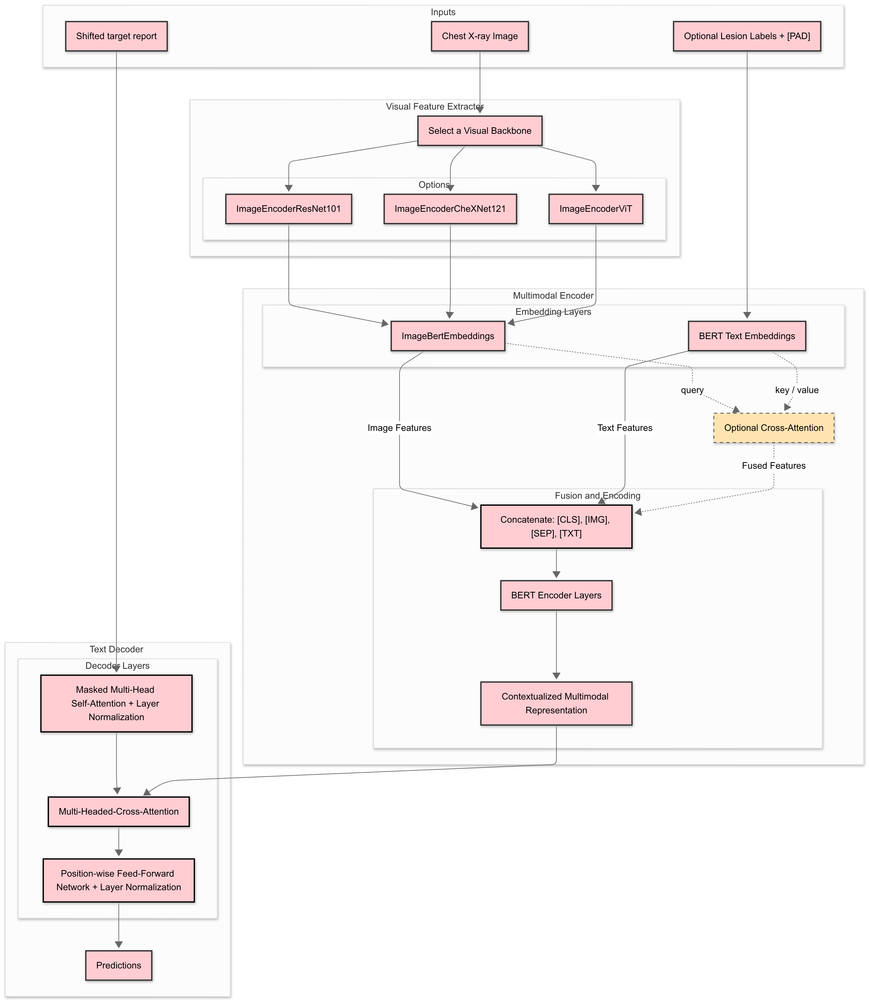

# **RadScribe: A Vision-Language Transformer for Clinical Radiology Report Generation**

  [](https://opensource.org/licenses/MIT)

RadScribe is an advanced research platform for the automated generation of clinical radiology reports from chest X-ray images. The demand on radiologists is continuously increasing, leading to significant workload pressures and potential delays in patient care. This project aims to address this critical challenge by providing a powerful deep learning model that can translate complex visual information from radiographs into fluent, accurate, and clinically relevant textual reports. By bridging the gap between medical imaging and natural language processing, RadScribe serves as a foundational tool for researchers and developers working to augment clinical workflows and advance the field of medical AI.

## **The Core Innovation**

The central innovation of RadScribe lies in its hybrid, domain-specialized architecture. Instead of relying on general-purpose vision and language models that must learn medical nuances from scratch, this project strategically integrates two powerful, pre-trained models that are already experts in their respective domains. This design choice is predicated on the understanding that for high-stakes fields like medicine, leveraging domain-specific knowledge is paramount for achieving robust and reliable performance.

The model synergistically combines:

* An **image encoder** founded on the principles of [MedViLL](https://arxiv.org/abs/2105.11333)
**, pre-trained to comprehend the intricate visual patterns and anomalies within biomedical images.  
* A **text decoder** built upon [ClinicalT5](https://physionet.org/content/clinical-t5/1.0.0/), pre-trained on a vast corpus of clinical notes, enabling it to generate text with the precise terminology, syntax, and structure of authentic medical documentation.

The core learning task for RadScribe during fine-tuning is not to learn visual and linguistic concepts from zero, but rather to learn the complex *mapping* between the rich visual features extracted by the MedViLL-based encoder and the sophisticated linguistic representations understood by the ClinicalT5-based decoder. This approach leads to greater data efficiency, faster convergence, and a higher likelihood of producing clinically sound reports compared to training a general-purpose model on the same dataset.

## **Core Features at a Glance**

* **State-of-the-Art Multimodal Architecture:** A sophisticated encoder-decoder Transformer specifically designed for vision-language tasks in the medical domain.  
* **Domain-Specific Transfer Learning:** Leverages powerful pre-trained weights from MedViLL and ClinicalT5 for superior performance, faster training, and improved data efficiency.  
* **End-to-End Research Workflow:** Provides a complete, reproducible pipeline covering data preprocessing, model pre-training, fine-tuning, and comprehensive evaluation.  
* **High-Performance Training:** Features integrated support for mixed-precision training (FP16/BFloat16) via PyTorch's torch.amp, significantly accelerating experimental cycles and reducing GPU memory footprint.  
* **Advanced Experiment Tracking:** Seamlessly integrated with Weights & Biases (W\&B) for real-time, interactive logging of metrics, loss curves, hardware utilization, and generated report samples.  
* **Clinically-Oriented Evaluation:** Moves beyond standard NLP metrics by incorporating a suite of custom evaluation tools designed to measure true clinical accuracy and factual correctness.

## **Technical Deep Dive**

### **Architectural Overview**

At its core, RadScribe is a multimodal encoder-decoder model that implements a sequence-to-sequence learning paradigm. The model processes a chest X-ray image as the input sequence and generates a textual radiology report as the output sequence.

## Network Architecture


    
This architecture is designed to first "see" and understand the clinical findings in the image and then "write" about them in a coherent and medically appropriate manner.

### **The Image Encoder: Learning to See**

The image encoder is responsible for transforming a raw pixel-based image into a rich, high-dimensional representation that captures its semantic content.

* **Visual Feature Extractor**
The model first processes the input X-ray using a powerful visual backbone. It supports multiple architectures, initialized with strong pre-trained weights:

ResNet101 ([101-elastic](https://arxiv.org/abs/2102.09475)): A ResNet model based on torchxrayvision 101-elastic.

[CheXNet121](https://arxiv.org/abs/1711.05225): A DenseNet121 model pre-trained on the ChestX-ray14 dataset.

Vision Transformer ([ViT](https://arxiv.org/abs/2010.11929)): A Transformer-based vision model from google/vit-base-patch16-224-in21k.

Fine-tuning Strategy:
A key aspect of this module is its efficient fine-tuning approach. During training, the upper layers responsible for general feature extraction are frozen. Only the lower, specialized layers are trained to identify specific clinical findings. This strategy preserves the powerful, generalized knowledge of the pre-trained models while efficiently adapting them to the medical report generation task and preventing catastrophic forgetting.
* **The MedViLL Advantage:** The true power of the encoder comes from its initialization with pre-trained weights derived from MedViLL (models/pre\_model\_weights/MedViLL). Unlike models pre-trained on generic datasets like ImageNet, MedViLL has been pre-trained on a massive corpus of biomedical images and their associated textual data. This specialized pre-training endows the encoder with a strong prior for recognizing clinically significant features, such as nodules, infiltrates, pleural effusions, or cardiomegaly, directly from the image data.

### **The Text Decoder: Learning to Write**

The text decoder takes the visual representation from the encoder and generates the final report in an auto-regressive fashion, producing one token at a time.

* **Model:** The decoder is based on the T5 (Text-to-Text Transfer Transformer) architecture. At each generation step, the decoder uses its self-attention mechanism to consider the previously generated text and a cross-attention mechanism to focus on the most relevant parts of the encoded image representation. This cross-attention is the critical link that allows the model to ground its textual output in visual evidence.  
* **The ClinicalT5 Advantage:** The decoder is initialized with weights from ClinicalT5 (models/pre\_model\_weights/ClinicalT5). ClinicalT5 is a T5 model that has been further pre-trained on a large-scale corpus of clinical notes. This process fine-tunes its language model to be fluent in the specific dialect of medicine, including its unique vocabulary, abbreviations, and sentence structures. This dramatically reduces the risk of the model generating text that is grammatically correct but clinically nonsensical or out of context, a common failure mode for generic language models applied to specialized domains.

## **Setup and Installation Guide**

### **Prerequisites**

* Python 3.12 or higher.  
* An NVIDIA GPU with CUDA support is strongly recommended for efficient training.  
* git for cloning the repository.

### **Installation Steps**

Follow these steps to set up the project environment. It is highly recommended to use a virtual environment to avoid conflicts with other projects.

```Bash

# 1\. Clone the repository from GitHub  
git clone https://github.com/Lune\_99/RadScribe.git  
cd RadScribe

# 2\. (Recommended) Create and activate a Python virtual environment  
python \-m venv venv  
source venv/bin/activate  \# On Windows use \`venv\\Scripts\\activate\`

# 3\. Install all required dependencies from the requirements file  
pip install \-r requirements.txt
```

### External Data & Model Weights

Due to size constraints, we host the preprocessed data and pretrained model weights on a separate cloud drive. Please follow the steps below to download and install them:

1. **Download archives**
   
   https://drive.google.com/drive/folders/1Dm1kegYuJMgxki8Vh3AxYTtiDfqKFR8U?usp=drive_link
   
   - **Preprocessed Data**
     `preprocessed_data.zip`
   - **Pretrained Weights**
     `model_weights.zip`


3. **Unzip into project structure**  
   After downloading, run from your project root:

   ```bash
   # Unzip preprocessed data
   unzip /path/to/preprocessed_data.zip -d .
   # This will populate:
   #   data/preprocessed/mimic/Train_10000.tar.gz
   #   data/preprocessed/mimic/Valid_500.tar.gz

   # Unzip model weights
   unzip /path/to/model_weights.zip -d .
   # This will populate:
   #   models/pre_model_weights/CheXnet/
   #   models/pre_model_weights/ClinicalT5/
   #   models/pre_model_weights/MedViLL/
   ```

### **Configuring Weights & Biases (W\&B)**

This project uses Weights & Biases for experiment tracking and visualization. To enable logging, you must have a W\&B account.

1. If you don't have an account, sign up for free at [wandb.ai](https://wandb.ai).  
2. Log in to your W\&B account from your terminal. You will be prompted for your API key.  
 ``` Bash  
   \# Log in to your Weights & Biases account  
   wandb login
```
3. Ensure you set your desired project and entity (your W\&B username or team name) in the relevant configuration file (e.g., configs/Base.yaml) before starting a training run.

## **Data Pipeline: Acquisition and Preprocessing**

### **Dataset Acquisition (MIMIC-CXR-JPG)**

**WARNING: Access to the MIMIC-CXR-JPG dataset is required to run this project.**

Due to the sensitive nature of patient data, the MIMIC-CXR-JPG dataset is governed by a strict data use agreement and cannot be redistributed. Access is restricted to credentialed researchers. This project provides a small sample of the data for pipeline verification, but for full training and evaluation, you must acquire the dataset yourself.

To gain access to the full dataset, follow these official steps:

1. **Become a Credentialed User on PhysioNet:** This is a mandatory first step. It requires completing the CITI "Data or Specimens Only Research" training course to ensure you understand the principles of working with human subjects' data.  
2. **Apply for Access:** Once you are a credentialed user, apply for access to the [MIMIC-CXR-JPG](https://arxiv.org/abs/1901.07042) dataset directly on the PhysioNet website: [https://physionet.org/content/mimic-cxr-jpg/2.0.0/](https://physionet.org/content/mimic-cxr-jpg/2.0.0/).  
3. **Download and Organize:** After your application is approved, download the full dataset. You will need the image files (files/) and the metadata/split files (mimic-cxr-2.0.0-chexpert.csv.gz, mimic-cxr-2.0.0-split.csv.gz). Place them in the appropriate directory as described below.

### **Data Structure and Preprocessing**

The project expects the following directory structure. The provided sample files allow you to test the data pipeline before acquiring the full dataset.
```Bash
RadScribe/  
└── data/  
    ├── mimic/  
    │   ├── Train\_10000.jsonl      \# Provided sample training data  
    │   └── Valid\_500.jsonl        \# Provided sample validation data  
    │   \# After download, place the full dataset files here:  
    │   ├── mimic-cxr-2.0.0-chexpert.csv.gz  
    │   ├── mimic-cxr-2.0.0-split.csv.gz  
    │   └── files/                 \# This directory contains the JPG image folders (p10, p11,...)  
    └── preprocessed/  
        mimic
        ├── train
        │ └── Train.tar.gz
        ├── test
        │ └── test.tar.gz
        └── valid
        └── valid.tar.gz
```
**Preprocessing Workflow:**

Once the full MIMIC-CXR-JPG dataset is in place, you must run the provided preprocessing scripts to prepare it for the model.


## **Project Configuration**

### **The YAML Configuration System**

All experiments are controlled through YAML configuration files located in the configs/ directory. This approach decouples the experimental setup from the core codebase, allowing for easy, reproducible, and trackable modifications to hyperparameters, model architecture, and data paths. To run a new experiment, you can simply copy an existing config file (e.g. Base.yaml) and modify the parameters as needed.

### **Key Configuration Parameters**

The following table details the most important parameters you can adjust in the YAML configuration files. This serves as a central reference for designing your experiments.

## 📌 Configuration File Documentation

This section describes the YAML configuration used to train the **MedViLL + ClinicalT5** based model for medical image report generation.

---

#### 🔧 Basic Training Settings

- **`use_amp`**: `true`  
  Enables **FP16 mixed precision training** to reduce GPU memory usage and accelerate training.

- **`project_name`**: `MedViLL-Decoder-Report-Generation`  
  Project name for experiment tracking (e.g., with Weights & Biases).

- **`entity`**: `Lune_99`  
  W&B user or team entity.

- **`task_name`**: `ViT-label-MedT5`  
  Descriptive task name for identifying runs.

- **`need_evaluate`**: `True`  
  Run evaluation during training after each validation step or epoch.

- **`log_step`**: `5000`  
  Interval (in steps) for logging metrics.

- **`is_early_stopping`**: `True`  
  Enables early stopping if validation performance plateaus.

- **`is_resume`**: `True`  
  Resume training from a checkpoint.

- **`is_initialize`**: `True`  
  Initialize model weights before training.

- **`is_finetune`**: `False`  
  Switch between full training and fine-tuning mode.

- **`train_with_label`**: `True`  
  Include auxiliary disease labels during training.

- **`output_dir`**: `'checkpoints/medT5_Train'`  
  Directory where model checkpoints are saved.

- **`checkpoint_path`**:  
  `'checkpoints/medvill_t5_funetune/ft-ViT-label_checkpoint_epoch_3_step_15000.pt'`  
  Path to the checkpoint file for resuming or inference.

---

#### 🏗️ Pre-trained Model Paths

- **`encoder_model_path`**: `'models/pre_model_weights/MedViLL'`  
  Pre-trained MedViLL encoder weights.

- **`decoder_model_path`**: `'models/pre_model_weights/ClinicalT5'`  
  Pre-trained ClinicalT5 decoder weights.

---

#### 📂 Dataset Parameters

- **Training dataset**:  
  `train_dataset_10000: data/mimic/Train_10000.jsonl`

- **Validation dataset**:  
  `valid_dataset_500: data/mimic/Valid_500.jsonl`

- **Image archives**:  
  - `train_img_archive: data/preprocessed/mimic/Train_10000.tar.gz`  
  - `valid_img_archive: data/preprocessed/mimic/Valid_500.tar.gz`

---

#### 🔄 Pretraining Weights

- **`pretrain_path`**: `'models/pre_model_weights/MedViLL'`  
- **`pretrain_path_T5`**: `'models/pre_model_weights/ClinicalT5'`

---

#### ⚙️ Data Loading

- **`num_workers`**: `4`  
  Number of workers for data loading.

---

#### 🖼️ Image Parameters

- **`img_encoder`**: `ViT`  
  Options: `ViT`, `resnet101_101-elastic`, `chexnet121`, `bertViT`.

- **`img_size`**: `512`  
  Input image resolution.

- **`img_channel`**: `3`  
  Number of image channels (RGB).

- **`num_image_embeds`**: `256`  
  Number of visual embeddings passed to the encoder.

---

#### 📝 Text Parameters

- **`seq_len`**: `253`  
  Maximum text token length.

- **`vocab_size`**: `30522`  
  Vocabulary size for tokenizer.

---

#### 🧠 Model Parameters

- **`vision_width`**: `768`  
- **`embedding_size`**: `768`  
- **`hidden_size`**: `768`  
- **`max_seq_len`**: `512`

---

#### 🎯 Training Parameters

- **`epochs`**: `20`  
  Number of training epochs.

- **`batch_size`**: `2`  
  Per-device batch size.

- **Optimizer Config**:
  ```yaml
  encoder:
    lr: 0.00005
    warmup_rate_enc: 0.1
    min_lr: 0.00001
    weight_decay: 0.01

  decoder:
    lr: 0.0001
    warmup_rate_dec: 0.1
    min_lr: 0.00002
    weight_decay: 0.005
    ```

## **Training and Evaluation Workflow**

### **Model Training**

To launch a training job, run the main train.py script and specify the desired configuration file using the \--config argument.

```Bash

# Launch training using a specific configuration file  
python train.py \--config configs/Base.yaml
```

The training script will perform the following steps:

1. Parse the specified YAML configuration file.  
2. Initialize the model architecture and load the pre-trained weights for the encoder and decoder.  
3. Set up the data loaders for the training and validation sets.  
4. Initialize the optimizer, learning rate scheduler, and W\&B logger.  
5. Begin the training loop. At the end of each epoch, it will run evaluation on the validation set.  
6. Save model checkpoints (the best-performing model and the latest model) to the checkpoints/ directory.  
7. Log all metrics, losses, learning rate, and sample generated reports to your W\&B dashboard for real-time monitoring.

To resume training from a saved checkpoint, you can modify the configuration file to include a path to the checkpoint file (.pt) under a resume\_from\_checkpoint parameter.

### **Inference and Report Generation**

Once a model has been trained, you can use it to generate a report for a new, unseen chest X-ray. A sample script is provided in the test/ directory.


### **Evaluation Protocol**

A rigorous evaluation protocol is critical to assess the performance of the RadScribe model in both linguistic quality and clinical accuracy. This project leverages a combination of **standard NLP metrics**, **semantic similarity measures**, and **clinically-focused evaluation metrics** to ensure comprehensive assessment.

---

#### 📊 **Standard NLP Metrics**

These metrics evaluate the textual overlap between the model-generated reports and the ground-truth references:

- **BLEU-4:** Measures 4-gram precision, commonly used in machine translation and text generation.  
- **ROUGE-1 / ROUGE-2 / ROUGE-L:**  
  - *ROUGE-1*: Unigram recall.  
  - *ROUGE-2*: Bigram recall.  
  - *ROUGE-L*: Longest common subsequence-based F-score.  
- **METEOR:** Captures semantic similarity by considering stemming, synonyms, and word order.  
- **CIDEr:** A consensus-based metric weighting n-grams based on their frequency across the corpus, particularly effective for image captioning tasks.

> ⚠️ **Limitation in clinical context:**  
> These metrics measure linguistic similarity but are agnostic to factual correctness. For example, if the ground truth states *“pneumonia in the right lower lobe”* and the model predicts *“pneumonia in the left lower lobe”*, BLEU/ROUGE/CIDEr might still score highly despite being clinically incorrect.

---

#### 🩺 UMLS-based Clinical Factuality Metrics

To move beyond linguistic similarity and assess true clinical correctness, **RadScribe** implements a custom evaluation suite based on the **Unified Medical Language System (UMLS)**. This approach provides a more comprehensive and fine-grained measure of factual accuracy than a fixed checklist of findings.

##### 🔍 Evaluation Process

1. **Entity Linking with scispaCy:**  
   For each generated report and its corresponding ground-truth reference, we use a [scispaCy](https://arxiv.org/abs/1902.07669) model to perform entity linking.  
   - This process scans the text and identifies clinical concepts, linking them to their unique identifiers (CUIs) in the UMLS knowledge base.  
   - The result is two sets of CUIs: one for the predicted report and one for the reference.

2. **Multi-Label Evaluation:**  
   The problem is framed as a multi-label classification task where each unique CUI is a distinct clinical "label".  
   We then compare the predicted CUIs against the reference CUIs to compute the following metrics:
   - **CLINICAL_PRECISION:** Proportion of clinical entities in the generated report that are correct (also present in the reference).
   - **CLINICAL_RECALL:** Proportion of ground-truth clinical entities successfully identified in the generated report.
   - **CLINICAL_F1:** Harmonic mean of clinical precision and recall.
   - **CLINICAL_ACCURACY:** Overall accuracy across the entire set of identified CUIs.

3. **Length-Penalty Adjustment:**  
   - A custom length penalty reduces the final scores if the number of unique clinical entities in the prediction differs significantly from the reference.  
   - This discourages the model from generating reports that are:
     - Too verbose (hallucinating findings)
     - Too brief (missing key findings)  
   - The penalty ensures both correctness and appropriate report coverage.

4. **Final Score Scaling:**  
   - After applying the length penalty, scores are scaled using a **tanh function** to maintain stable values within a bounded range.

---

### ✅ Why This Metric Matters

This custom UMLS-based metric suite provides a **robust and clinically-relevant assessment** of the model’s performance by directly measuring:
- The correctness of identified clinical entities.
- The completeness of findings.
- The balance between report detail and factual accuracy.


---

#### 🔤 **Token-Level Generation Metrics**

To ensure lexical quality beyond high-level n-grams:

- `TOKEN_ACCURACY`: Percentage of correctly generated tokens compared to ground truth.  
- `TOKEN_PRECISION` / `TOKEN_RECALL` / `TOKEN_F1`: Token-level overlap metrics providing a fine-grained measure of sequence similarity.

---


## **Community**

### **Citation**

If you use RadScribe in your research, please cite this repository to acknowledge the work.
```Bash
@misc{radscribe2024,  
  author \= {Lune\_99},  
  title \= {RadScribe: A Vision-Language Transformer for Clinical Radiology Report Generation},  
  year \= {2024},  
  publisher \= {GitHub},  
  journal \= {GitHub repository},  
  howpublished \= {\\url{https://github.com/Lune\_99/RadScribe}}  
}
```
### **Acknowledgments**

* This project is developed and maintained by **Lune\_99**.  
* This work would not be possible without the public release of the **MIMIC-CXR-JPG** dataset by the MIT Laboratory for Computational Physiology.  
* The model architecture is deeply indebted to the pioneering research behind the **MedViLL** and **ClinicalT5** models, which established the power of domain-specific pre-training.

## **License**

This project is licensed under the **MIT License**. You can find the full license text in the `LICENSE` file.

The MIT License is a permissive open-source license that allows broad use, modification, and distribution of the code in both academic and commercial projects. It requires that all copies or substantial portions of the software include the original copyright notice and permission statement, ensuring proper attribution while maximizing flexibility for collaboration and reuse.
